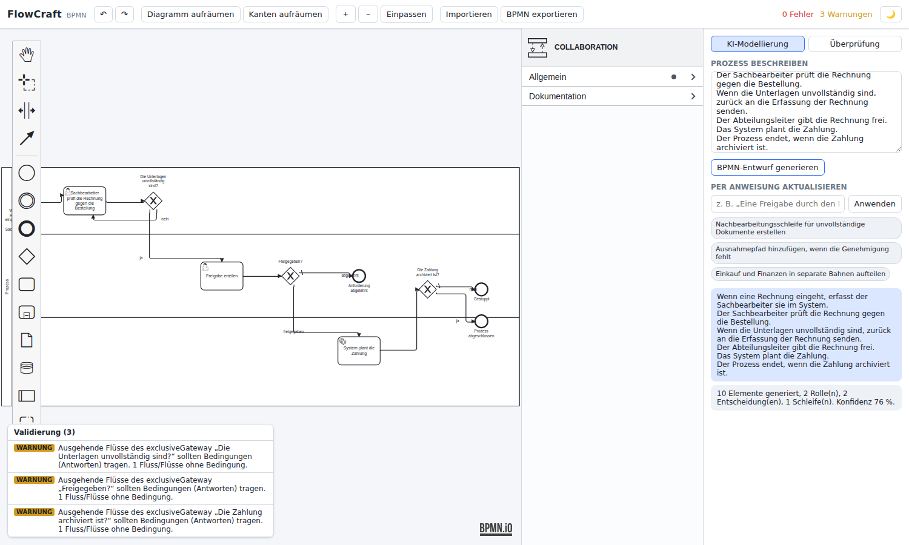

# FlowCraft — Production-grade BPMN modeler with a custom layout/routing engine and AI-assisted modeling

FlowCraft is a working BPMN 2.0 modeling web app that pairs the **bpmn-js**
editor (the bpmn.io toolkit — professional rendering, palette, context pad,
direct editing and a properties panel) with a **custom FlowCraft engine** that
adds the things bpmn-js does not: **AI text-to-BPMN generation**,
**instruction-based diagram updates**, a **layered auto-layout + orthogonal
obstacle-aware router with dedicated back-edge/loop channels** exposed as
one-click *cleanup*, and **BPMN rule validation**. The engine is framework-
agnostic TypeScript with its own normalized model and BPMN 2.0 XML I/O, and is
unit-tested headlessly; it talks to bpmn-js by round-tripping BPMN XML.

> Architecture note: an earlier version shipped a fully custom SVG renderer to
> maximise control over routing/layout. It was replaced by bpmn-js for the
> editing surface so the look and interaction match bpmn.io, while the custom
> engine remains the differentiator (AI + layout/routing cleanup + validation).
> This is the deliberate trade-off behind the "Editor-Basis" decision.



---

## Sprache / Language

The product UI ships in **German** (Toolbar, palette, panels, validation
messages, AI review). The AI pipeline is **bilingual**: the deterministic
extractor and the instruction parser understand both German and English process
descriptions and commands, and synthesized labels (branch conditions, generated
task/end names) are localized to the detected input language. The codebase and
this README stay in English.

## Quick start

```bash
npm install
npm run dev        # http://localhost:5173
npm test           # 73 engine tests (vitest, headless), incl. layout stress + optimality
npm run bench:layout  # layout quality metrics on the benchmark corpus
npm run build      # type-check + production bundle
npm run typecheck  # strict tsc, no emit
```

### LLM modelling (Claude)

Both **text → BPMN** and **changing an existing diagram by instruction**
(„Nach der Prüfung eine Freigabe durch die Teamleitung einfügen“) run through
Claude when the server has an API key. The LLM produces the complete process
model — elements, types, gateways, conditions, flows, loops, lanes; the layout
engine places it (LLMs are unreliable at geometry). For edits the LLM receives
the whole current diagram with its element ids and returns the full updated
model; unchanged elements keep their ids, documentation texts, boundary events
and — where it costs no extra crossings — their arrangement. New elements are
highlighted green, changed ones orange, as a preview to accept or reject.
External parties (customer, authority, client) become their own collapsed
pools, connected only by message flows. Rework loops are drawn as short
channels right below the flow, entered through an XOR merge instead of a
second arrow into the task. Elements the AI format cannot represent (data
objects, annotations, sub-process contents) are reported before you accept.
Without a key both fall back to the offline rule-based parser, and the chat
says so.

**Process library.** Every process is saved automatically (1.5 s after a
change) in the browser's IndexedDB: diagram, AI input text and open AI
questions. *📁 Bibliothek* lists, searches, opens, renames, duplicates and
deletes processes; the last opened one is reopened on the next visit. A newly
generated process gets its own entry instead of overwriting the open one. What
is on screen is saved, an AI preview included (closing the tab without
*Übernehmen* loses nothing); *Verwerfen* restores the previous state and
removes the draft entry of a rejected new process. The library lives in this browser on
this device and this site address only — *Bibliothek sichern* writes a JSON
backup, *Sicherung laden* restores it (same id: newer version wins), which is
also how the library moves to another browser or host.

**Process simulation.** Every change runs an exhaustive token-flow check
(`src/core/simulation/soundness.ts`): all reachable states of the process are
explored with BPMN token semantics (XOR/AND/OR gateways, boundary and terminate
events, subprocess scopes), so problems on *any* path are found — deadlocks
(e.g. an AND-join after an XOR decision, or a path that ends inside a parallel
section), double execution (AND-split merged by XOR), loops without exit and
unreachable elements. Findings appear under *Ablauf* in the diagram check with
an example run; clicking one selects all involved elements. Unnamed elements
are named by their place ("beim ODER-Gateway vor „Sicherheitskonzept prüfen“").

**BPMN standard (ISO/IEC 19510).** The token rules follow clause 13 of the
standard: an OR join waits only for a token that can still reach an empty
input *and* cannot reach one that already holds a token (table 13.3 — a
simpler rule raised false deadlocks on loops inside parallel blocks);
activity outputs without a condition always run (13.3.1); complex gateways
synchronise like OR joins (10.6.5). The diagram check covers the mandatory
rules of clause 10 (boundary, intermediate and link events, start/end,
event-based gateways) and names the clause ("Norm 10.5.4"). Recommendations
that are not in the standard — line crossings, a rework loop that restarts
every parallel branch — are marked *Stil* and never count as errors. The
standard itself is not part of the repository (licensed document).

**AI and the standard.** The AI instructions include these rules, and the AI
format has boundary events (activity, trigger, interrupting or not); the
layout places their exception path behind the activity. With *Normverstösse
automatisch korrigieren lassen* (off by default, remembered per browser), a
draft with violations of the standard goes back to the AI once as an edit
instruction (`src/core/ai/correct.ts`); the corrected draft is kept only if it
has fewer violations. This costs a second AI call, only when there is
something to correct.

*▶ Simulation* plays the process by itself (`src/core/simulation/scenarios.ts`,
`src/ui/bpmn/auto-sim.ts`): paths are chosen so that every answer at every
gateway is taken at least once and every loop once; tokens run along the
connections, parallel branches advance together, and each path is judged
(✓ reaches the end, ✕ gets stuck / runs twice, with the spot marked red).
Click a path to replay it. The panel also shows the verdict of the exhaustive
check, which covers combinations no single path shows. *Manuell simulieren*
(top left of the canvas) is the step-by-step token simulation of
[bpmn-js-token-simulation](https://github.com/bpmn-io/bpmn-js-token-simulation)
(MIT), where you pick the way at each gateway yourself.

**Version history.** Every *In Bibliothek speichern* (Ctrl+S) stores a version
(unchanged states are not duplicated; the newest 20 per process are kept).
*🕘 Versionen* sets any version side by side with the current state —
removed red, new green, changed orange, plus a change list — and restores it
(the current state is kept as a version first). Versions are part of the
library backup file.

**Word / PDF as input.** *Word / PDF laden* (or dropping a file on the text
field) converts a `.docx` or a text PDF to Markdown **in the browser** — the
file never leaves the machine; only the Markdown, shown in the text field for
review first, goes to the AI. Headings, numbered steps, bullet lists and
responsibility tables are kept; images, tables of contents, running
headers/footers and page numbers are dropped. PDF pages that are a drawn
diagram are left out (their labels make no sense without the arrows), scans
without a text layer are reported instead of being sent. Limit: 30 000
characters per generation (checked before anything is sent). Visio is not
supported yet; old `.doc` files must be saved as `.docx`.

- **Cloudflare Workers (primary host):** [`worker/index.ts`](worker/index.ts)
  serves the built app as static assets, with the access gate
  ([`server/access.ts`](server/access.ts)) in front of everything and the AI
  endpoint ([`server/llm.ts`](server/llm.ts), `POST /api/generate`) behind it.
  Configuration in [`wrangler.jsonc`](wrangler.jsonc); secrets
  `ANTHROPIC_API_KEY`, `ACCESS_CODES`, `ACCESS_SECRET` are set in the
  Cloudflare dashboard. The key never reaches the browser.
- **Netlify (alternative):** the same server code runs as edge functions
  (`netlify/edge-functions/*`, thin wrappers); variables under *Project
  configuration → Environment variables*.
- **Locally:** `npm run build && npx wrangler dev --var ANTHROPIC_API_KEY:sk-…
  --var ACCESS_CODES:me:some-long-code --var ACCESS_SECRET:…` serves app,
  gate and endpoint in Cloudflare's runtime. Plain `npm run dev` has no
  `/api/generate`, so it always uses the offline parser.

The endpoint is intentionally narrow (fixed model, prompt and output schema,
input ≤ 30 000 characters) so it cannot be used as a general Claude proxy. It
passes Claude's event stream through unparsed and the browser reads it
([`src/core/ai/stream.ts`](src/core/ai/stream.ts)): on Cloudflare's free plan a
request may use only ~10 ms CPU, and piping bytes costs almost none. Access
needs a personal access code; there is no per-person rate limit, so set a
spending limit in the Anthropic console.

Try it: open the app → **KI-Modellierung** tab → keep the German sample text →
**BPMN-Entwurf generieren**. Then type an instruction such as *„Eine Freigabe
durch den Manager vor der Zahlung hinzufügen“* and click **Anwenden**. Export to
`.bpmn` and re-import it — geometry, conditions and lanes round-trip.

Sample inputs live in [`samples/ai-prompts.md`](samples/ai-prompts.md); ready
made `.bpmn` files (generated by the engine, with real DI geometry) are in
[`samples/`](samples/).

---

## Layout guarantees (what is proven, and how)

Layout runs entirely in the browser — it never calls the AI and costs nothing.
It is verified on 10 000 randomly generated, realistic processes (nested
XOR/AND/OR blocks, event-based choices, loops, early ends, 0–6 lanes, ~50
elements on average, ~500 000 elements in total): `npx vite-node
scripts/stress-layout.ts 10000`.

| Criterion | Result on 10 000 processes | Status |
|---|---|---|
| Flows lying on top of each other | 0 | guaranteed by construction, tested |
| Flows running through shapes | 0 | guaranteed by construction, tested |
| Flows leaving the pool | 0 | guaranteed by construction, tested |
| Diagonal flow segments | 0 | guaranteed by construction, tested |
| Overlapping shapes | 0 | guaranteed by construction, tested |
| Crossings | minimised, not zero | see below |

**Crossings cannot be guaranteed to be zero** — by any tool: many processes
cannot be drawn without them (e.g. two parallel branches in different lanes
that hand over to each other's lane). What is guaranteed instead:

- The node order is optimal: compared against an exhaustive search over all
  orders, the layout finds the minimal number of crossings in 299/299 small
  and 261/262 medium processes; whenever zero crossings are possible, it
  achieves zero (467/467). `test/layout-stress.test.ts` checks this on every
  run.
- Track order between columns is solved exactly (dynamic programming).
- Remaining crossings are shown in the app's *Diagramm-Prüfung* — the user
  always sees the state of the drawing; manual edits that create overlaps or
  flows through shapes are flagged with the fix (*Kanten aufräumen*).

Gateway branches to the same side share one corner as a trunk
(“bundles” in the metrics) — standard BPMN notation, not an overlap.

## 1. Open-source analysis (Phase 1)

| Library | Solves well | Not good enough for this product | Decision |
|---|---|---|---|
| **bpmn-js** | Mature, professional rendering & editing of BPMN incl. BPMNDI, palette, context pad, direct label editing, undo/redo, keyboard — the bpmn.io look | Routing is connection-docking + manual bends (not obstacle-aware, no crossing minimisation, no loop channels); no auto-layout; no AI | **Used as the editing surface.** This delivers the bpmn.io-class look & interaction users expect. *(Initial version used a custom SVG renderer; switched to bpmn-js per the "Editor-Basis" decision.)* |
| **bpmn-js-properties-panel / @bpmn-io/properties-panel** | Standard bpmn.io properties editing UI | English labels only | **Used** for the properties sidebar. |
| **diagram-js** | Interaction primitives underpinning bpmn-js | — | **Used transitively** via bpmn-js. |
| **bpmn-auto-layout** | Lightweight, turns headless BPMN into a placed diagram by walking the flow | Greedy flow-walk; degrades on joins, re-merging parallel branches and loops; back edges become long ugly lines; not crossing-aware; not lane-aware | **Replaced** with the custom layered (Sugiyama-style) layout used by the *cleanup* action: rank assignment ignoring back edges, weighted-median crossing reduction, barycenter coordinates with overlap resolution, lane-banded placement. |
| **dagre / elkjs** | High-quality layered/orthogonal layout | dagre unmaintained, not BPMN/lane/back-edge aware; elk large, async, needs heavy BPMN adaptation | **Not used.** The custom layered passes are deterministic, synchronous, testable and tuned for BPMN reading direction + loops. |
| **fast-xml-parser** | Fast, dependency-light XML parsing | — | **Used** for engine import; export is a custom deterministic writer for clean, DI-complete output (the bpmn-js↔engine seam). |
| **zustand** | Minimal, predictable state | — | **Used** to coordinate the modeler, AI panel, validation and theme. |

**What we build on top of bpmn-js (the differentiators):**
- Custom **internal model** (`src/core/model`) + **BPMN 2.0 XML** I/O — the seam
  the engine uses to read/replace the bpmn-js diagram.
- Custom **layered layout** with back-edge-aware ranking and swimlane bands,
  surfaced as **"Diagramm aufräumen"** (clean up diagram).
- Custom **orthogonal router**: direction-aware A* with a turn penalty + a
  dedicated **back-edge channel** strategy, surfaced as **"Kanten aufräumen"**.
- Custom **validation** engine (scopes, gateways, events, readability).
- Custom **bilingual AI pipeline** (NL → IR → BPMN) that never writes to the
  canvas directly — it produces XML the modeler imports.

## 2. Architecture decision (Phase 1, as revised)

- **Stack:** TypeScript + React 18 + Vite. Vitest for headless engine tests.
- **Editing surface:** **bpmn-js** (bpmn.io) + properties panel + a German
  translate module. bpmn-js owns the live diagram and all manual modeling.
- **Engine integration:** the FlowCraft engine reads the diagram via
  `modeler.saveXML()` → `importBpmn` and writes back via `exportBpmn` →
  `modeler.importXML()` (see `src/ui/bpmn/bridge.ts`). AI generation, cleanup
  (layout+routing) and validation all run through this XML seam.
- **Layout:** layered/Sugiyama (longest-path ranks with back edges removed →
  median crossing reduction → barycenter Y with hard overlap resolution →
  lane-banded variant, wrapped in a pool for bpmn-js). Deterministic.
- **Routing:** uniform-grid, **direction-aware A\*** with turn penalty for
  forward edges (orthogonal, dodges shapes, minimises bends + crossings) and a
  **deterministic channel router** for back edges (each loop folds into its own
  horizontal lane beneath the content, fanned so loops never stack). Ports are
  fanned along node sides for clean gateway splits/joins.
- **AI pipeline:** primary path is `text → server (Worker) → Claude (structured
  output: Graph IR = nodes + flows + lanes) → sanitize/repair → BPMN mapping →
  layout → route → quality assessment → review`. The LLM emits JSON only; it
  never writes BPMN or touches the canvas. Offline fallback is the
  deterministic step-list extractor (`segment → classify → IR → mapping`).
  Both paths are scored by the same model-level quality check, so confidence
  reflects the diagram actually produced.
- **State:** zustand store coordinating the bpmn-js modeler instance, AI panel,
  validation results and theme. Undo/redo is bpmn-js' own `commandStack`. (The
  engine also ships a snapshot-based `History` in `src/core/commands`, used in
  headless tests and available for engine-driven flows.)
- **Separation of concerns:** editor surface + integration (`src/ui`, incl.
  `src/ui/bpmn` bridge/translate), BPMN logic + AI + routing + layout +
  validation + IO (`src/core/*`), state (`src/state`). The whole `src/core` tree
  has zero React/DOM dependencies and is testable in Node.
- **Technical risks & mitigations:** grid A\* cost on very large diagrams →
  bounded grid + per-scope blocked-grid reuse, back edges bypass A\* entirely;
  NL ambiguity → surfaced as assumptions/ambiguities rather than hallucinated;
  model stability after edits → instructions mutate in place + re-layout, not
  regenerate.
- **Where standard library behaviour is improved:** loop/back-edge routing,
  crossing reduction, lane-aware placement, deterministic output, and an
  auditable AI-to-model mapping with provenance.

## 3. Project structure

```
src/
  core/                 # framework-agnostic engine (no React/DOM)
    model/              # types, factory, graph utils (adjacency, back-edge DFS, topo)
    geometry/           # points, sides, intersection, path simplification
    layout/             # layered Sugiyama layout (+ lane bands) + autoLayout orchestrator
    routing/            # direction-aware A* router + back-edge channel router + message flows
    validation/         # BPMN structural + semantic + readability rules
    xml/                # BPMN 2.0 + BPMNDI import (fast-xml-parser) and export (custom writer)
    ai/                 # types(IR) + extract(NL→IR) + map(IR→BPMN) + instructions + llm hook
    commands/           # snapshot-based undo/redo History (engine/tests)
  state/                # zustand store coordinating the bpmn-js modeler + AI + validation
  ui/
    components/         # Canvas (bpmn-js mount), Toolbar, AiPanel, ValidationPanel
    bpmn/               # bridge (engine↔modeler XML seam) + German translate module
test/                   # vitest suites (engine)
samples/                # engine-generated .bpmn files + AI prompt library
scripts/                # sample generator + Playwright smoke test
docs/                   # architecture notes + screenshots
```

## 4–5. Implementation & tests

See `src/` and `test/`. Run `npm test` — 73 tests cover BPMN import/export,
routing around obstacles, gateway branch fanning, back-edge channels, lane
placement, layout determinism, undo/redo, validation rules, bilingual
text-to-BPMN extraction (EN + DE), and instruction-based updates (approval, lane
split, exception path, node replacement, re-layout), Graph-IR mapping and
repair, the quality assessment, and the streaming LLM client protocol.

`test/layout-quality.test.ts` gates the layout on a corpus of realistic
processes: 0 crossings, 0 overlapping flows, 0 flows through shapes or outside
the pool. `scripts/smoke-pdf.mjs` generates a diagram in the browser, opens the
process description and exports the PDF.

`scripts/smoke-llm.mjs` drives the LLM path in the real app with
`/api/generate` mocked (no API key needed).

A Playwright smoke test (`scripts/smoke.mjs`) drives the real bpmn-js app: it
generates a diagram from German text (5 → 27 shapes / 10 connections), applies a
German instruction (→ 35 shapes), runs the engine *cleanup*, opens the review
panel — asserting no console errors.

## 6. Feature coverage

**BPMN elements:** start/end/intermediate/boundary events (+ message/timer/error/
signal/escalation/terminate definitions), task/user/service/script/send/receive/
manual/business-rule tasks, sub-process (collapsed/expanded), call activity,
exclusive/parallel/inclusive/event-based gateways, sequence/message flows,
associations, data object & data store references, text annotations, pools,
lanes, loop & multi-instance markers, default flows, conditions.

**Modeling UX:** palette, click-to-place, drag-move with live re-routing,
quick-connect handle, marquee + multi-select, inline rename, properties editing,
delete, undo/redo, keyboard shortcuts (Ctrl+Z/Y, Del, Ctrl+A, Esc, +/-, L),
snap-to-grid, zoom-to-cursor, pan, light/dark.

**Documentation:** automatic process description (tab *Beschreibung*: summary,
roles, numbered step table, open points; updates live) and **PDF export**
(diagram as vector graphics + description), Markdown export.

**Quality tools:** *Clean up diagram* (re-layout + re-route), *Clean up flows*
(re-route only), live validation panel with click-to-locate, readability hints.

**AI:** text→BPMN, instruction→update, review panel (roles/systems/documents/
decisions/approvals/checks/loops/exceptions/assumptions/ambiguities + confidence),
provenance (every element traces to source text), ambiguity surfacing.

## Limitations (honest)

- Pools/lanes are modeled and laid out; full pool *resize-by-drag* and
  cross-pool message-flow drawing in the canvas are basic (message flows are
  routed automatically and validated, and import/export them fully).
- The deterministic NL extractor is rule-based; it is strong on SOP/step-list/
  role-prefixed/“if…otherwise” business processes (its target domain) and
  surfaces ambiguity rather than inventing logic. It fails on free-form prose;
  that is what the Claude path is for.
- AI edits drop data objects, annotations, other process pools and
  sub-process contents (reported in the preview; *Verwerfen* restores the diagram).
- The LLM path has been verified end-to-end only against a mocked API (Deno +
  browser); output quality on real process texts still needs a test set.
- A\* routing is tuned for diagrams up to a few hundred nodes; beyond that the
  grid step should be increased (a documented knob in `DEFAULT_ROUTING`).
- Expanded sub-process *inline* editing reuses the root scope coordinates;
  drilling into a sub-process as a separate plane is on the roadmap.

See [`ROADMAP.md`](ROADMAP.md) for what comes next.
